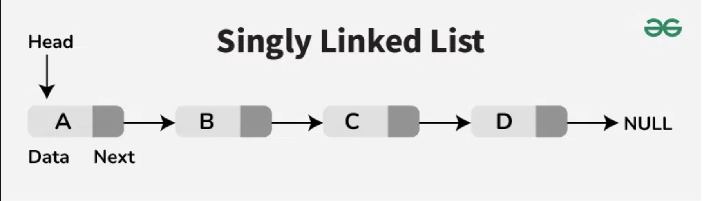

# Linked List

	
English 🇬🇧

## What is Linked List ?

Is a linear data structure in which the elements are not stored in contingus memory locations and each element is connected only to its next element using a pointer.

Linked List forms a series of connected nodes, where each node stores the data and the address of the next node.

Node Structure: A node in a linked list typically consists of two composnents:
	* **Data**: It holds the actual value or data associated with the node
	* **Next** (Pointer or Reference): It stores the memory address (reference) of the next node in the sequence.

**Head and Tail**: The linked list is accessed through the head node, which points to the first node in the list. The last node in the list point to **NULL** or **nullptr**, indicating the end of the list. This node is known as the tail node.

## Why Linked List data structure needed ?

The main case where we prefere linked list over arrays is due to ease of insertion and deletion in linked list. 

For instance, in a system, if we maintain a sorted list of IDs in an array id[] = {1000, 1010, 1050, 2000, 2040}.

If we want to insert a new ID 1005, then to maintain the sorted order, we have to move all the elements after 1000 (excluding 1000).

Deletion is also expensive with arrays until unless some special techniques are used. For example, to delete 1010 in id[], everything after 1010 has to be moved due to this so much work being done wich affects the efficiency of the code.

In an arrays, each case are contigus, stored in memory area side by sidem fro instance 100 are sotred ine the address 23, 1010 in 24 etc., this is why we need to move all parts of sorted array if we want to store a new ID. In Linked List, is not the case,1000 can be stored in address 23, 1010 in adress 54 etc. so we can add new ID on it without thinking of move the parts of array. We only need to change few pointer (or reference) to insert (or delete) an item in the middle.

## Example of application of linked list and application in real world

### Application of linked list

* To implements stacks, queue, deaue, sparse matrices and adjacency list representation of graphs
* dynamic memory allocation in porating systems and compilers (linked list or free blocks)
* Manipulation of polynomials
* Arithmetic operations on long integers
* In operating systems, they can be used in Memory management, process scheduling (for example circular linked list for round robin shceduling) and file system
* Algorithms that need to frequently insert or delete items from a large collections of data
* LRU cache, which uses a doubly linked list to keep track of the most recently used items in cache

### Appliction of linked list in real world

* List of songs of music player are linked to the previous and next songs
* In a web browser, previous and next web page URLs can be linked with the help of the previous and next buttons (Doubly linked list). We can do the same thing for example with an image viewer, linked previous and next image with a buttons(also Double linked list).
* Circular linked lists can be used to implement things in round manner where we go to every element one by one.
* Linked list are preferred over arrays for implementations of Queues and Deque data structures because of fast deletions (or insertions) from the front of the linked list

## Advantage and disadvantage of Linked List

### Advantage

- Useful for insertion and deletion
- Can be also used to implement a stack, queues, and other abstract data structure
- Implementation of Queue and Deque (also known as a double-ended queue) data structures: Simple array implementation are not efficient at all for that, we must use circular array to efficiently implement which is complex, but with linked list, it is easy and straighforward. That why most of the language library use linked list internally to implement these data structure
- Linked List can be more efficient than array in case where where we cannot guess the number of element in advance. In case of arrays, the whole memory for items is allocated together. even with dynamic sized arrays like vector in C++ or list in Python or ArrayList in Java. The internal working invlolve de-allocation of whole memory and allocation of a bigger chunk when insertions happen beyond the current capacity. 

### Disadvantage

- Slow access time, accessing element in a linked list can be slow, as you need to traverse the linked list to find the element you are looking for, which is as O(n) operation. This make linked lists a poor choice for situations where you need to access elements quickly
- Linked List use pointer and references to access the next node, which can make them more complex to understand and use compared to arrays. This complexity can make linked list more difficult to debugs and maintain.
- Linked list have overhead compared to arrays, each nide in a linked list requires extrq memory to store the reference to the next node
- Linked list are cache-ineficien because the memory is not contiguous. This means that when you traverse a linke list, you are not likely to get the data you need in the cache, leading to cache misses and slow performance.
- Arrays are relatively very esay to use and are avalaible as core of most programing language

## Resume:

* The consecutive elements are connected by pointers / reference
* The last node of the linked list point to null
* The entry point of a linked list is known as the head
* The common variations of linked lists are ***Sinlgy, Doubly, Singly Circular*** and ***Doubly Circular***
* It is poweful and flexible but hey have a certain disadvantage that need to be taken in consideration when deciding wither to use them or not. If we need fast access time, arrays might be a better choice, but if we need to insert or delete elements frequently, linked list might be the better choice.

	
French 🇫🇷

## C'est quoi une liste chainée/liée ?

C'est une structure de donnée linéaire dans laquelle les éléments ne sont pas stocker les unes à la suite des autres en mémoire, chacun des élément de cette liste sont connecter uniquement via un pointeur qui pointe vers cet élément suivant dans la liste.

La liste chainée forme une série de noeuds, ou chacun de ses noeuds contiens la donnée et l'adresse du noeud suivant.

Structure d'un noeud: Un noeurd dans une liste chainée et composé de deux partie:
	* **Partie données**: Cette partie contient la valeur actuel ou les données associée à ce noeud.
	* **Partie next (référence à l'élément suivant)**: Celle-ci contient l'adresse en mémoire (ou la référence) à notre élément suivant dans notre séquence.

**Début et Fin**: On accède à notre liste chainée par le début, la "tête" du premier noeud, c'est notre point d'entrée dans la liste. Le dernier noeud dans notre list aura un **NULL** ou **nullptr**, indiquant que nous somme à la fin de cette liste.

## En quoi les listes chainée sont elle utile ?

Le principal cas d'utilisation de cette structure de données par rapport à un tableau (array) sera dans des cas d'ajout ou de suppression dans notre liste.

Par exemple, dans un sytème ou nous devons maintenir et mettre à jour un tableau d'ID dans un ordre croissant id[] = {1000, 1010, 1050, 2000, 2040}.

Si on veut ajouter un nouvel ID dans ce tableau, par exemple 1005, tout en préservant l'ordre croissant du plus petit au plus grand, on va devoir déplacer tout nos élément du tableau après 1000, tout en excluant précisément 1000.

Si on veut supprimer un élément, cela sera tout aussi fastidieux, par exemple si on veut supprimer 1010 dans notre tableau, tout ce qui se trouve après 1010 devra aussi être déplacer. Toutes ces contraintes à prendre en compte rend pénible la solutions à devoir implémenter dans notre code.

Les tableaux (array), chaque case de celui ci sont stocker en mémoire de manière continue les unes à là suites des autres, c'est pourquoi on doit déplacer à chaque fois une partie du tableau pour insérer un élément à l'endroit approprier dans notre liste d'ID ordonnée. Avec les listes chainée, nos noeuds ne sont pas stocker en mémoire de façon continue, elle peut se trouver à un emplacement différent, par exemple 1000 se trouve à l'adresse 23, et 1010 se trouve à l'adresse 54 etc. Cela nous permet donc d'ajouter ou supprimer des élément sans se soucier d'avoir à déplacer une partie ou une autre dans le cas d'un tableau (array).

source :

- https://www.geeksforgeeks.org/applications-advantages-and-disadvantages-of-linked-list/
- https://www.geeksforgeeks.org/what-is-linked-list/
