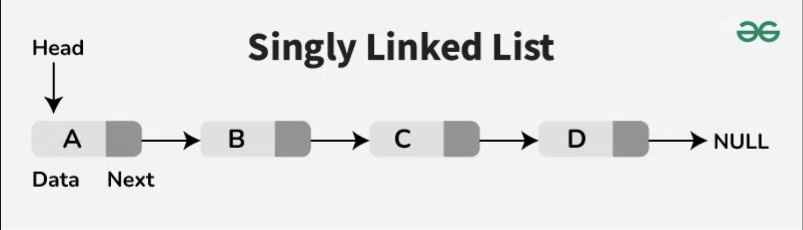

# Singly Linked List

[Singly Linked List. source: https://www.geeksforgeeks.org/introduction-to-singly-linked-list/](../img/Single-linked-list-forms.png)

## What is a Singly Linked List ?

Is a fundamental data structure in computer science and programming, it consists of nodes where each node contains a reference to the next node in the sequence. Traversing a singly linked list is done in a forward direction, and the last node points to null, indicating the end of the list. This linear structure supports efficient insertion and deletion operationss, maiking it widely used in various application. We'll explore the node structure, understand the operations on singly linked lists (traversal, searching, length determination, insertion, and deletion), and provide detailed explanations and code examples to implements these operations effectively.

## Node structure

In a singly linked list, each node consist of two parts: 
- Data: The data part stores the actual information,  
- Pointer to the next node: The pointer (or reference) part stores the address of the next node in the sequence.

This structure allows the node to be dynamically lined together, forming a chain-like sequence.



In this representation, each box represents a node, with an arrow indicating the link to the next node.
The last node points to NULL, indicating the end of the list.

In most programming languages, a node in a singly linked list is typically defined using a class or a struct.
```
typedef struct Node Node;
struct Node{
	int value;
	Node *next;
};
